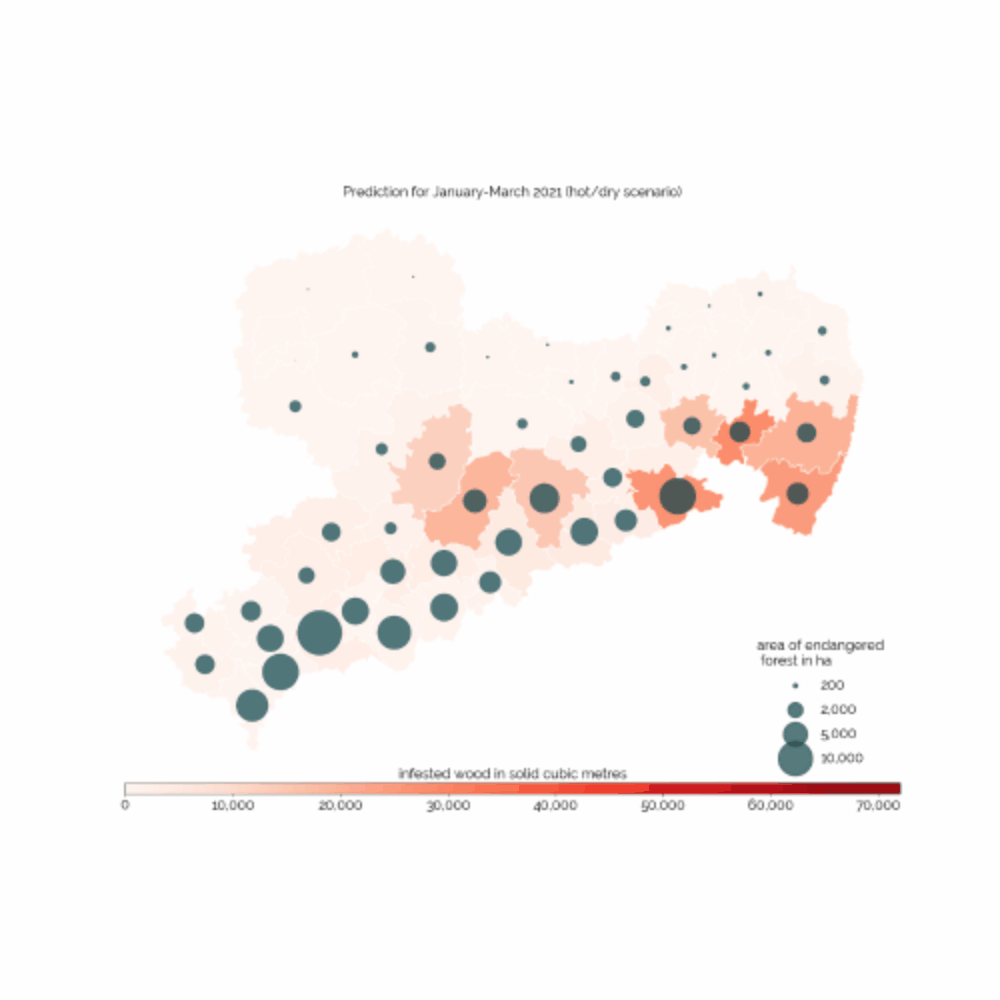

# Bark Beetles: Predicting the Plague

**Author**  
Yannic Holländer

## Introduction
Europe's forests are dying at an unprecedented pace.

Over the last few years, recurring draught periods have weakened the natural defence systems of coniferous trees like spruces, pines and larches and contributed to the rapid reproduction of bark beetles. As a direct result, large parts of European forests have vanished since 2018. Epicentre of the German bark beetle epidemic is the Free State of Saxony, which is currently facing its greatest forest dieback since the beginning of kept forestry records. In this region alone, 9.1 million cubic metres of damaged wood were reported over the last three years. Half of this amount is directly attributed to the spruce bark beetle.

 

**Introduction Sources:**  
[1] [Reuters: "Climate change to blame as bark beetles ravage central Europe's forests"](https://www.reuters.com/article/us-centraleurope-environment-barkbeetle-idUSKCN1S21LA)  
[2] [Forestry: "The bark-beetle invades Europe"](https://www.forestry.com/editorial/bark-beetle-invades-europe/)  
[3] [Sachsen.de: "Aktuelle Borkenkäfersituation in Sachsen"](https://www.wald.sachsen.de/aktuelle-situation-2020-8793.html?)  
[4] [New York Times: "Climate Change Strikes at the Heart of German Identity: The Woods"](https://www.nytimes.com/2019/12/24/world/europe/germany-climate-change-forests.html)

## Objective
This project, made in collaboration with "Staatsbetrieb Sachsenforst", aims to support the fight against the spruce bark beetle by predicting the amount of infested wood in short-time intervals for locally distinct spatial administrative units within Saxony. This approach differs from previous ones, where predictions were made for larger areas and greater time periods. More meticulous predictions, powered by machine learning algorithms, would facilitate the targeted use of *Sachsenforst*'s resources by predicting potential infestation hotspots in the region and contribute to the plannability of future local outbreaks.

The dataset is first constructed from four different data sources. Additionally, an Exploratory Data Analysis (EDA), in which beetle phenology is compared to the relationships present in the data, is part of this project. Deployment takes place in such a way, that *Sachsenforst* can use the fitted model to forecast of the amount of infested wood for all 106 forestry district and forest ownership group combinations for specific climate scenarios.

## Results
The various data sources were successfully combined into a single data set. Correlations between the individual predictors and the target variable were often limited, especially on the narrowly defined temporal and local level. Nevertheless, the final regression model produces reasonable predictions, which was confirmed in an initial evaluation by *Sachsenforst*. Despite some shortcomings regarding long-term forecasts, the model is suitable for estimating the scale of the future bark beetle infestation development for individual administrative units, especially when combined with empirical and expert knowledge. A definitive statement regarding model applicability can at the earliest be made after the actual target values of the 2021 periods are available to be compared to the forecast values. The contents of this project also form a basis for future model developments and more complex solution approaches regarding the prediction of bark beetle infestations in short-time intervals and comparatively small locales and districts.

## Repository Structure

In consultation with *Sachsenforst*, Jupyter Notebooks were chosen as the preferred method of documenting and supplying all project code. The following files are found in this repository:

**1_Data_Aggregation.ipynb** - This notebook encompasses the merging of the four main data sources. A single dataset containing all relevant information on the bark beetle infestation in Saxony is created. Subsequent notebooks use this dataset for data analysis and model training.   

**2_EDA.ipynb** - In this notebook the Exploratory Data Analysis (EDA) takes place. Describing relationships between different (target/explanatory) variables enables a deeper understanding of the underlying processes regarding infestation development and sets expectations for feature selection as well as model performance.  

**3_Model_Training.ipynb** - In this notebook sets of prediction models for the amount of infested wood are fitted. The models make predictions for one timeframe, one forestry district and for one ownership group at a time (analogous to the dataset structure). Mutiple approaches are compared, their models evaluated and the most appropriate model chosen for deployment.

**4_Model_Deployment.ipynb** - With the help of this notebook the model can be used to forecast the amount of infested wood based on multiple user-defined scenarios. 
**forestry_districts.png** - A map of the current forestry districts and counties within Saxony. Serves as a guide for the reader to be able to follow along specific sections of the EDA. Embedded in '2_EDA.ipynb'.

**model.pkl** - The final regression model as a pickle file. Written as part of '3_Model_Training.ipynb'.

**teaser_animation.gif** - Teaser animation used in this readme. 

